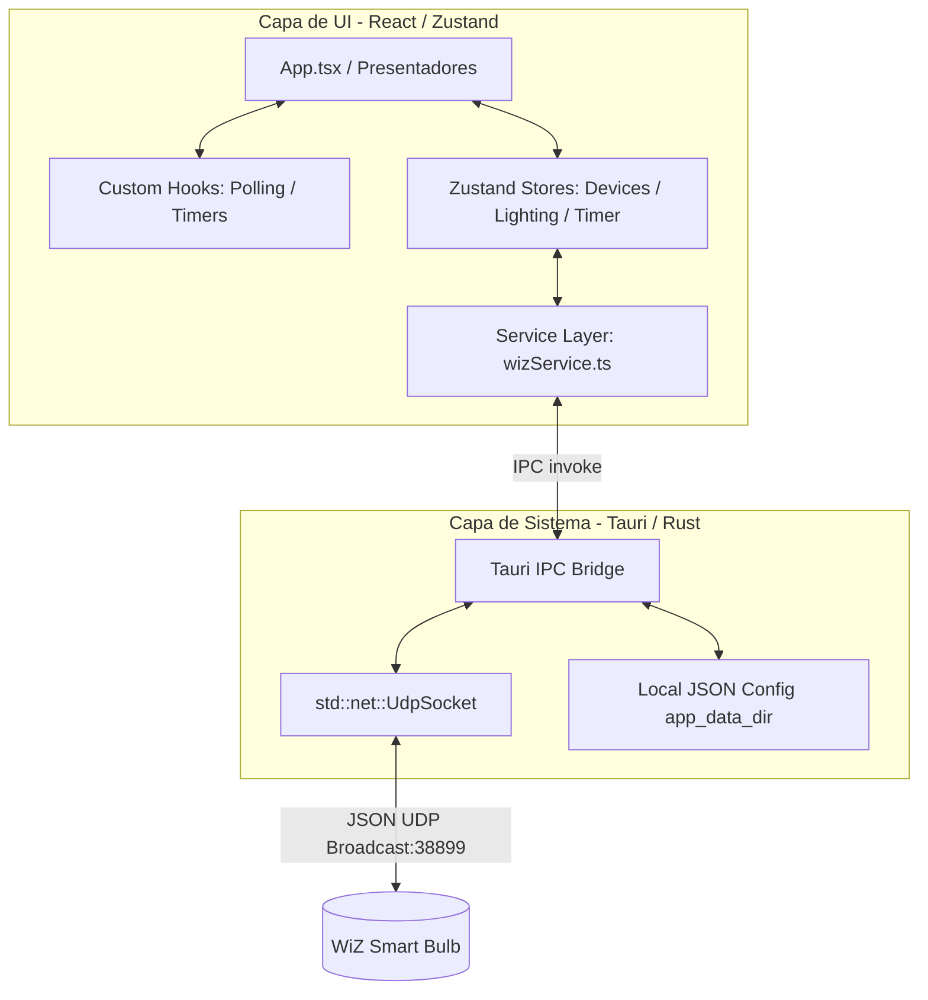

# WiZ Control 🖥️💡

<p>
  
  
  
  
  
  
</p>

**WiZ Control** es una aplicación nativa de escritorio para macOS diseñada para descubrir, controlar e interactuar con bombillas inteligentes **WiZ** en tu red local. La aplicación prescinde por completo de la nube y de servidores web intermediarios, comunicándose directamente mediante sockets **UDP** en tiempo real. 

El proyecto adopta los lineamientos visuales de **Apple Design System** (macOS Dark Mode) y implementa una arquitectura desacoplada basada en tiendas modulares (*Zustand*), separación de efectos colaterales (*custom hooks*) y una capa de abstracción de servicios para la comunicación IPC con Tauri.

---

## 🏗️ Arquitectura del Sistema

El software está dividido en dos capas bien definidas, separando la lógica de bajo nivel del sistema operativo y red de la interfaz visual reactiva:



### 1. Capa de Servicios (`src/services/`)
Toda comunicación nativa con Tauri a través de `invoke` se centraliza en `wizService.ts`. Los almacenes de estado (stores) y componentes visuales no conocen la implementación subyacente del bridge IPC. Esto permite:
- Modularidad e intercambio fácil de la capa de comunicación (por ejemplo, reemplazar polling por una suscripción a Tauri Events en el futuro).
- Facilidad para escribir pruebas unitarias simulando (*mocking*) el servicio.

### 2. Estructura basada en Características (`src/features/`)
La aplicación se organiza por dominios funcionales independientes en lugar de tipos de archivo técnicos, lo que permite escalar el proyecto limpiamente al añadir nuevas características:
*   **`devices`**: Búsqueda UDP de bombillas, hidratación de alias de configuración y selección del dispositivo activo.
*   **`lighting`**: Control de encendido, brillo, presets, colores RGB rápidos, escenas dinámicas y cálculo del ritmo circadiano.
*   **`timer`**: Administración síncrona del temporizador y desvanecimiento progresivo.
*   **`layout`**: Comportamiento de Titlebar de arrastre e integraciones estéticas de ventana.

### 3. Zustand Stores & Slices Modulares
Evitamos un único almacén monolítico en favor de tres tiendas enfocadas:
- `useDeviceStore`: Estado de descubrimiento de red e IP seleccionada.
- `useLightingStore`: Parámetros lumínicos del foco activo.
- `useTimerStore`: Conteo síncrono del temporizador.
Las tiendas son **completamente deterministas** y se comunican entre sí consultando `.getState()` para mantener el desacoplamiento.

### 4. Aislamiento de Efectos Colaterales en React Hooks
Para evitar fugas de memoria o asincronías descontroladas dentro de los stores, los bucles de tiempo (`setInterval`) y programaciones reactivas se extraen a custom hooks de React:
- `useWizLightPolling`: Coordina el polling de estado cada 5 segundos de la bombilla seleccionada.
- `useSleepTimerCountdown`: Ejecuta el segundero y aplica la reducción gradual del brillo del foco si el timer está activo.

### 5. Actualizaciones Optimistas con Rollback
La interfaz de control responde de manera instantánea a los clics del usuario actualizando el estado local de forma optimista. Si la llamada UDP falla (por ejemplo, si el foco se desconecta de la red eléctrica), la aplicación captura el error e inmediatamente **revierte el estado al valor anterior**, informando la pérdida de conexión en el panel de estado.

---

## 🎨 Apple Design System Aesthetics
La interfaz está construida para mimetizarse perfectamente con macOS:
*   **macOS Titlebar Overlay:** Configuramos `"titleBarStyle": "Overlay"` y `"hiddenTitle": true` en Tauri. Esto permite que macOS dibuje de forma nativa las curvas redondeadas de la ventana, la sombra proyectada en el escritorio y el semáforo de control (*Traffic Lights*) directamente sobre el canvas del WebView, eliminando cualquier artifacto o borde cuadrado.
*   **Paleta de Color Oscura:** Basada en el tema oscuro nativo de Apple (`#141416` para el fondo y `#1c1c1e`/65 para los paneles de control).
*   **Tipografía y Componentes:** Empleo exclusivo de fuentes de sistema de Apple (`SF Pro Display`/`SF Pro Text`) y controles estilizados como los switches de iOS (`systemGreen` `#34c759`).

---

## 🔌 Protocolo WiZ UDP
Las bombillas WiZ escuchan comandos en formato JSON a través del puerto UDP **38899**. La aplicación implementa este protocolo de forma nativa en Rust:

- **Descubrimiento (Broadcast):** Envía un paquete UDP al puerto `38899` en la IP `255.255.255.255` consultando el estado piloto:
  ```json
  {"method":"getPilot","params":{}}
  ```
- **Control Directo:** Envía comandos específicos a la IP asignada:
  ```json
  {"method":"setPilot","params":{"state":true,"dimming":80,"temp":3000}}
  ```

---

## 🚀 Guía de Ejecución y Compilación

### Requisitos Previos
- **Node.js** (v18+)
- **pnpm** (o npm/yarn)
- **Rust Compiler** (Cargo y rustc 1.77+)

### Modo Desarrollo
Para ejecutar la ventana de la aplicación de escritorio nativa con recarga rápida (HMR):
```bash
pnpm run dev
```

### Typechecking y Linter
```bash
pnpm run typecheck  # Valida tipos de TypeScript
pnpm run lint       # Analiza el código con ESLint
```

### Compilar Paquete de Producción
Genera la aplicación empaquetada e instaladores nativos en el disco (DMG y APP de macOS):
```bash
pnpm tauri build
```
Los ejecutables se guardarán en `src-tauri/target/release/bundle/`.

---

## 📝 Changelog & Versión `v1.0.0`
- **v1.0.0 (Consolidación de Arquitectura)**
  - Migración completa de backend de Flask/Python a Tauri (v2) y Rust UDP.
  - Implementación de estado global basado en Zustand (separación por features).
  - Capa de abstracción de servicios (`wizService`).
  - Aislamiento de efectos colaterales de tiempo en Custom Hooks de React.
  - Soporte nativo para Titlebar Overlay en macOS (Traffic Lights nativos y bordes perfectos).
  - Rollback optimista ante fallos de conexión UDP con el foco.

---

## 📄 Licencia
Este proyecto es de código abierto y está disponible bajo los términos de la [Licencia MIT](LICENSE).
